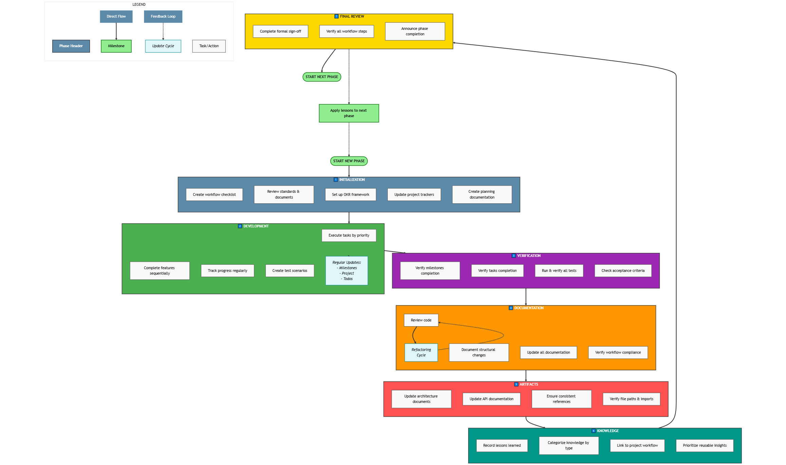

# TourGuideAI

A comprehensive tour guide application that leverages AI to provide personalized travel experiences.

## Project Structure

```
TourGuideAI/
├── .babelrc              # Babel configuration for React/JSX
├── .cursor/              # Project management files
│   └── .workflows        # Project workflow documentation
├── .github/              # GitHub Actions workflows
│   └── workflows/        # CI/CD, security scanning, and stability checks
├── build/                # Production build output
├── deployment/           # Deployment configurations
├── docs/                 # Project documentation
│   ├── project_lifecycle/  # Project lifecycle documentation
│   │   ├── code_and_project_structure_refactors/  # Code structure changes
│   │   ├── deployment/     # Deployment documentation
│   │   ├── knowledge/      # Knowledge base
│   │   ├── process_monitors/  # Process monitoring
│   │   ├── stability_tests/   # Stability testing
│   │   │   ├── plans/         # Test plans
│   │   │   ├── records/       # Test execution records
│   │   │   │   └── test-results/  # Timestamped test results
│   │   │   └── references/    # Test reference materials
│   │   └── version_control/   # Version control
│   ├── references/       # Reference documentation
│   ├── screenshots/      # Visual documentation assets
│   └── prototype/        # Prototype documentation
├── jest.config.js        # Jest configuration for testing
├── public/               # Static assets and service worker
│   ├── offline.html      # Offline fallback page
│   └── service-worker.js # Service worker for offline support
├── scripts/              # Build and maintenance scripts
│   ├── run-security-audit.js  # Security testing script
│   ├── run-load-tests.sh      # Load testing script
│   └── run-stability-tests.js # Stability test runner
├── server/               # Backend server code
│   ├── middleware/       # Express middleware
│   ├── routes/           # API route handlers
│   └── utils/            # Server utility functions
├── src/                  # Source code
│   ├── api/              # Legacy API functions (migration in progress)
│   ├── components/       # Reusable UI components
│   │   └── common/       # Shared UI components
│   ├── contexts/         # React contexts for state management
│   ├── core/             # Shared code across features
│   │   ├── api/          # API clients for external services
│   │   ├── components/   # Shared UI components
│   │   ├── services/     # Shared application services
│   │   └── utils/        # Utility functions and helpers
│   ├── features/         # Feature modules
│   │   ├── map-visualization/
│   │   ├── travel-planning/
│   │   ├── user-profile/
│   │   └── beta-program/ # Beta program management
│   │       ├── components/
│   │       │   ├── analytics/
│   │       │   ├── auth/
│   │       │   ├── feedback/
│   │       │   ├── onboarding/
│   │       │   └── survey/
│   │       └── services/
│   ├── pages/            # Main page components
│   ├── services/         # Legacy services (migration in progress)
│   ├── setupTests.js     # Jest setup for component tests
│   ├── styles/           # CSS and styling files
│   ├── tests/            # Component-specific tests
│   │   ├── pages/        # Page component tests
│   │   ├── components/   # Reusable component tests
│   │   ├── api/          # API integration tests
│   │   └── stability/    # Frontend stability tests
│   └── utils/            # Utility functions
└── tests/                # End-to-end and integration tests
    ├── stability/        # Frontend stability tests
    ├── cross-browser/    # Cross-browser compatibility tests
    └── load/             # Performance and load testing
```

## Development Workflow

This project follows a structured development workflow to ensure consistency and quality. The workflow is documented in `.cursor/.workflows` and includes:

1. **Phase Initialization**
   - Review project structure and requirements
   - Set up milestones and tasks
   - Create necessary documentation

2. **Development Process**
   - Execute tasks according to priorities
   - Regular updates to project status
   - Continuous testing and validation

3. **Phase Completion**
   - Comprehensive code review
   - Documentation updates
   - Test execution and validation

4. **Project Artifacts**
   - Architecture documentation
   - API documentation
   - Test results and coverage reports

## Testing Strategy

The project implements a comprehensive testing strategy as outlined in `docs/stability-test-plan.md`:

- Unit Tests: Component and function testing
- Integration Tests: Component interaction testing
- End-to-End Tests: Complete user flow testing
- Stability Tests: System reliability testing

Test execution results are tracked in `docs/project_lifecycle/stability_tests/records/test-results/` with detailed reports for each test run.

### Running Stability Tests

To run stability tests and verify frontend and backend resilience:

```bash
# Run all stability tests and generate a report
node scripts/run-stability-tests.js

# Run a specific test file
npx jest src/tests/stability/frontend-stability.test.js

# Run only backend resilience tests
npx jest src/tests/stability/frontend-stability.test.js -t "Backend Resilience"
```

Test results are automatically saved to `docs/project_lifecycle/stability_tests/records/test-results/` with timestamped JSON files tracking pass/fail metrics.

### Test Configuration

The project uses the following configuration files for testing:

- `.babelrc` - Babel configuration with React and environment presets
- `jest.config.js` - Jest configuration with JSDOM environment and proper transformers
- `src/setupTests.js` - Global test setup including custom matchers and mocks

These configurations ensure consistent test behavior across all components and environments.

## Getting Started

These instructions will help you set up and run the project on your local machine for development and testing purposes.

### Prerequisites

- Node.js (v14.0.0 or higher)
- npm (v6.0.0 or higher)
- Google Maps API key
- OpenAI API key
- SendGrid API key (for email notifications)

### Installation

1. Clone the repository:
   ```
   git clone https://github.com/yourusername/TourGuideAI.git
   cd TourGuideAI
   ```

2. Install dependencies:
   ```
   npm install
   ```

3. Create environment files:

   Create a `.env` file in the root directory:
   ```
   # API Configuration
   REACT_APP_API_URL=http://localhost:5000/api
   REACT_APP_GOOGLE_MAPS_API_KEY=your_google_maps_api_key_here

   # Feature Flags
   REACT_APP_ENABLE_OFFLINE_MODE=true
   REACT_APP_ENABLE_CACHING=true

   # Cache Configuration
   REACT_APP_CACHE_EXPIRY=86400
   REACT_APP_MAX_CACHE_SIZE=52428800
   ```

   Create a `.env` file in the server directory:
   ```
   # Server Configuration
   PORT=5000
   NODE_ENV=development

   # OpenAI API Configuration
   OPENAI_API_KEY=your_openai_api_key_here
   OPENAI_API_KEY_ROTATION_INTERVAL=30

   # Google Maps API Configuration
   GOOGLE_MAPS_API_KEY=your_google_maps_api_key_here
   GOOGLE_MAPS_API_KEY_ROTATION_INTERVAL=30

   # Security
   ENCRYPTION_KEY=your_encryption_key_here
   RATE_LIMIT_WINDOW_MS=900000
   RATE_LIMIT_MAX_REQUESTS=100

   # Logging
   LOG_LEVEL=debug
   LOG_FILE_PATH=./logs/app.log
   
   # JWT Authentication
   JWT_SECRET=your_jwt_secret_here
   JWT_EXPIRATION=86400
   
   # SendGrid Email Configuration
   SENDGRID_API_KEY=your_sendgrid_api_key_here
   SENDGRID_FROM_EMAIL=noreply@yourdomain.com
   SENDGRID_VERIFICATION_TEMPLATE_ID=your_template_id
   SENDGRID_PASSWORD_RESET_TEMPLATE_ID=your_template_id
   SENDGRID_WELCOME_TEMPLATE_ID=your_template_id
   ```

### Getting API Keys

#### Google Maps API Key

1. Go to the [Google Cloud Console](https://console.cloud.google.com/)
2. Create a new project or select an existing one
3. Navigate to APIs & Services > Library
4. Enable the following APIs:
   - Maps JavaScript API
   - Places API
   - Directions API
   - Geocoding API
5. Go to APIs & Services > Credentials
6. Click "Create credentials" and select "API key"
7. Copy your new API key
8. (Optional but recommended) Restrict the API key to the specific APIs you enabled
9. Update both `.env` files with your Google Maps API key

#### OpenAI API Key

1. Go to [OpenAI API](https://platform.openai.com/)
2. Sign up or log in to your account
3. Navigate to the API keys section
4. Create a new API key
5. Copy your API key and update the server `.env` file

### Running the Application

To run both the frontend and backend servers concurrently:

```
npm run dev
```

Or run them separately:

```
# Start the frontend
npm run start

# Start the backend
npm run server
```

The frontend will be available at http://localhost:3000 and the backend at http://localhost:5000.

## Documentation

The project maintains comprehensive documentation organized by purpose. For a complete inventory of all documentation, see [Document Inventory](docs/project.document-inventory.md).

<table>
  <tr>
    <td width="50%" align="center">
      <strong>Project Documentation Map</strong><br>
      <br>
      <em>Shows how documentation files are connected and their relationships throughout the project. Color coding indicates different document types and their purposes.</em>
    </td>
    <td width="50%" align="center">
      <strong>Project Workflow</strong><br>
      <br>
      <em>Illustrates the development process through seven phases: initialization, development, verification, documentation, artifacts, knowledge management, and final review.</em>
    </td>
  </tr>
</table>

### Project Management Documentation
- Project workflow: [.cursor/.workflows](.cursor/.workflows)
- Project milestones: [.cursor/.milestones](.cursor/.milestones)
- Project status: [.cursor/.project](.cursor/.project)
- Task tracking: [.cursor/.todos](.cursor/.todos)
- Project workflow visualization: [docs/pics/flowchart/.mermaidworkflow](docs/pics/flowchart/.mermaidworkflow)
- Documentation map visualization: [docs/pics/flowchart/.mermaidfilesmap](docs/pics/flowchart/.mermaidfilesmap)
- Diagrams README: [docs/pics/flowchart/README.md](docs/pics/flowchart/README.md)

### Process Documentation
- Workflow checklists: [docs/project_lifecycle/process_monitors/plans/project.workflow-checklists.md](docs/project_lifecycle/process_monitors/plans/project.workflow-checklists.md)
- Phase signoff: [docs/project_lifecycle/process_monitors/plans/project.phase-signoff.md](docs/project_lifecycle/process_monitors/plans/project.phase-signoff.md)
- Version history: [docs/project_lifecycle/version_control/records/project.versions.md](docs/project_lifecycle/version_control/records/project.versions.md)
- Refactoring history: [docs/project_lifecycle/code_and_project_structure_refactors/records/project.refactors.md](docs/project_lifecycle/code_and_project_structure_refactors/records/project.refactors.md)
- Refactoring plans: [docs/project_lifecycle/code_and_project_structure_refactors/plans/project.refactors-plan.md](docs/project_lifecycle/code_and_project_structure_refactors/plans/project.refactors-plan.md)
- Lessons learned: [docs/project_lifecycle/knowledge/project.lessons.md](docs/project_lifecycle/knowledge/project.lessons.md)

### Development Documentation
- Architecture overview: [ARCHITECTURE.md](ARCHITECTURE.md)
- API overview: [API_OVERVIEW.md](API_OVERVIEW.md)
- API migration guide: [API_MIGRATION.md](API_MIGRATION.md)
- Deployment pipeline: [docs/project.deployment-pipeline.md](docs/project.deployment-pipeline.md)
- Performance optimization: [docs/project.performance-optimization-plan.md](docs/project.performance-optimization-plan.md)

### Testing Documentation
- Testing strategy: [docs/project.stability-test-plan.md](docs/project.stability-test-plan.md)
- Test scenarios: [docs/project.test-scenarios.md](docs/project.test-scenarios.md)
- Test user stories: [docs/project.test-user-story.md](docs/project.test-user-story.md)
- Stability test results: [docs/project_lifecycle/stability_tests/records/test-results](docs/project_lifecycle/stability_tests/records/test-results)
- Stability test execution: [scripts/run-stability-tests.js](scripts/run-stability-tests.js)
- Legacy test results: [docs/project.test-execution-results.md](docs/project.test-execution-results.md)

### Reference Documentation
- Code review checklist: [docs/references/code-review-checklist.md](docs/references/code-review-checklist.md)
- Version control: [docs/references/version-control.md](docs/references/version-control.md)
- Dependencies tracking: [docs/references/dependencies-tracking.md](docs/references/dependencies-tracking.md)
- Code review guide: [docs/references/whats-code-review-looking-for.md](docs/references/whats-code-review-looking-for.md)

## Features

- Chat-based travel planning interface
- Interactive map visualization of travel routes
- Detailed timeline view of daily activities
- Offline capability for saved routes
- User profile management
- Role-based access control for beta testers and administrators
- Email notifications with verification and password reset capabilities
- Comprehensive onboarding workflow for new beta users
- Customizable survey system with conditional logic
- Analytics dashboard with real-time usage metrics
- Feedback collection with screenshot and recording capabilities

## Application Pages

1. **Chat Page**: Input travel preferences and generate personalized tour plans
2. **Map Page**: Visualize routes on an interactive map with nearby attractions
3. **User Profile Page**: View and manage saved routes
4. **Beta Portal**: Access point for beta testers with the following features:
   - **Onboarding**: Step-by-step setup for new beta users
   - **Feedback**: Submit feedback with screenshots and recordings
   - **Surveys**: Participate in and manage customizable surveys
   - **Analytics**: View usage metrics and insights (admin only)

## Technology Stack

- React with well-structured component architecture
- React Router with proper route configuration
- Material UI with ThemeProvider for consistent styling
- OpenAI API
- Google Maps API
- JWT Authentication
- SendGrid Email API
- Role-based Access Control (RBAC)
- Recharts for data visualization
- HTML2Canvas for screenshot capture
- Robust error boundaries and graceful degradation

## Refactoring Philosophy

Throughout development, we've applied several key refactoring principles:

- **Code Consolidation**: Reducing duplication by centralizing common functionality
- **Parameter Standardization**: Consistent naming conventions across interfaces
- **Performance Optimization**: Regular improvements to frontend and backend performance
- **Security Hardening**: Progressive enhancement of security practices
- **Infrastructure Automation**: Continuous improvement of CI/CD processes
- **Frontend Stability**: Ensuring robust React component architecture with proper error handling

See `docs/project.refactors.md` for a detailed history of refactoring efforts and `docs/project.lessons.md` for lessons learned.

## Troubleshooting

### Google Maps Issues

If you see the error "This page didn't load Google Maps correctly":

1. Check that your Google Maps API key is correctly set in the `.env` file
2. Make sure the key is not restricted to specific domains that exclude localhost
3. Verify that you've enabled all required Google Maps APIs in your Google Cloud Console
4. Check the browser console for specific error messages

### API Connection Issues

If you're having trouble connecting to the APIs:

1. Ensure your OpenAI API key is correctly set in the server `.env` file
2. Check that the server is running (`npm run server`)
3. Make sure the `REACT_APP_API_URL` in the frontend `.env` points to the correct server address

### Testing Issues

If you're experiencing test failures:

1. **Jest configuration issues**:
   - Verify that `.babelrc` and `jest.config.js` are in the project root
   - Ensure `identity-obj-proxy` is installed for CSS modules
   - Check that `setupTests.js` is properly configured

2. **MapPage test crashes**:
   - Use the simplified mock approach for complex components
   - Avoid circular dependencies in tests
   - Mock Google Maps API responses completely

3. **ESM vs CommonJS conflicts**:
   - When testing files with `import` statements for third-party libraries like axios, use proper Jest transformers
   - Add problematic packages to `transformIgnorePatterns` in jest.config.js if needed

4. **Viewing test results**:
   - Check the latest results in `docs/project_lifecycle/stability_tests/records/test-results/`
   - Run `node scripts/run-stability-tests.js` to generate a fresh report

## Security Configuration

### Environment Setup

1. **Generate secure keys**:
   ```
   node scripts/generate-keys.js
   ```
   This will generate secure random keys for JWT_SECRET and ENCRYPTION_KEY.

2. **Copy and configure environment files**:
   ```
   cp .env.example .env
   cp server/.env.example server/.env
   ```
   Then update the `.env` files with your secure keys and API credentials.

3. **Verify .env files are git-ignored**:
   Ensure `.env` files are listed in `.gitignore` to prevent accidentally committing secrets.

### Security Best Practices

- Never commit `.env` files or any files containing secrets to version control
- Rotate API keys and secrets regularly
- Use strong passwords (minimum 12 characters) for all admin accounts
- In production, use a secrets manager service instead of environment files where possible
- For production deployment, use a secure vault service (AWS Secrets Manager, HashiCorp Vault, etc.)

## Token Security Configuration Guide

TourGuideAI uses a secure token vault system to protect all sensitive credentials like API keys, secrets, and tokens. This section explains how to configure and manage this system.

### Setting Up the Token Vault

1. Configure vault settings in your server `.env` file:

```
# Token Vault Configuration
VAULT_BACKEND=local          # Options: local, aws, hashicorp, in-memory
VAULT_ENCRYPTION_KEY=your_secure_encryption_key_here
VAULT_SALT=your_secure_salt_here
VAULT_PATH=./vault/vault.enc # For local backend
IMPORT_ENV_SECRETS=true      # Import legacy env vars on startup
```

2. For initial setup, set `IMPORT_ENV_SECRETS=true` and provide your API keys as regular environment variables:

```
# These will be imported to the vault on first run
OPENAI_API_KEY=your_openai_key_here
GOOGLE_MAPS_API_KEY=your_google_maps_key_here
JWT_SECRET=your_jwt_secret_here
SENDGRID_API_KEY=your_sendgrid_key_here
```

3. Start the server once to initialize the vault and import secrets:

```bash
npm run start
```

4. After initial import, you can remove the raw API keys from your environment file and set `IMPORT_ENV_SECRETS=false`.

### Managing Tokens

Use the built-in token rotation tool for secure token management:

```bash
npm run rotate-tokens
```

This interactive CLI tool allows you to:
- List tokens that need rotation
- Rotate tokens securely
- Add new tokens to the vault
- List all tokens in the vault

### Configuring Different Environments

#### Development (Default)
- Use `VAULT_BACKEND=local` for simple file-based storage
- Store the vault file in a location excluded from version control

#### Production
- Use `VAULT_BACKEND=aws` for AWS Secrets Manager integration
- Set `AWS_REGION`, `AWS_ACCESS_KEY_ID`, and `AWS_SECRET_ACCESS_KEY` for AWS access
- Or use `VAULT_BACKEND=hashicorp` for HashiCorp Vault integration
- Set `VAULT_REMOTE_ENDPOINT` and `VAULT_REMOTE_TOKEN` for remote vault access

#### High-Security Environments
- Use a Hardware Security Module (HSM) to store the `VAULT_ENCRYPTION_KEY`
- Use AWS KMS or similar service to manage encryption keys
- Set up automated rotation alerts for expiring tokens

### Security Best Practices

1. **Encryption Key Security**: Store the `VAULT_ENCRYPTION_KEY` and `VAULT_SALT` securely, preferably in a separate system from the vault file
2. **Regular Rotation**: Rotate API keys according to the recommended schedules:
   - API Keys: 90 days
   - JWT Secrets: 180 days
   - Encryption Keys: 365 days
3. **Access Control**: Limit access to the token rotation tool to administrators
4. **Backend Selection**: Use appropriate vault backends based on environment security requirements
5. **Monitoring**: Set up alerts for tokens nearing rotation dates

## Contributing

Please read [CONTRIBUTING.md](CONTRIBUTING.md) for details on our code of conduct and the process for submitting pull requests.

## License

This project is licensed under the MIT License - see the [LICENSE](LICENSE) file for details.

