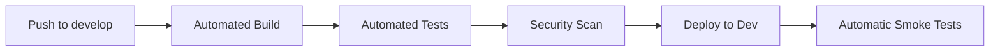
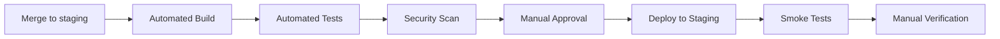
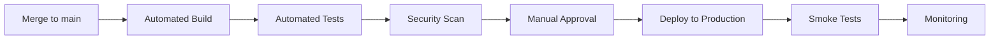
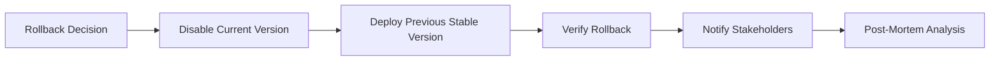

# TourGuideAI Deployment Pipeline - Version 0.5

## 1. Overview

This document outlines the deployment pipeline and procedures for TourGuideAI Version 0.5. It describes the environments, deployment steps, verification processes, and rollback procedures to ensure reliable and consistent deployments.

## 2. Deployment Environments

### Development Environment
- **Purpose**: Daily development work and initial testing
- **URL**: http://dev.tourguideai.local
- **Update Frequency**: Continuous (on commit)
- **API Keys**: Development API keys with limitations
- **Branch**: `develop`

### Staging Environment
- **Purpose**: Pre-production testing and verification
- **URL**: https://staging.tourguideai.app
- **Update Frequency**: After sprint completion or major feature implementation
- **API Keys**: Test API keys with production-like limits
- **Branch**: `staging`

### Production Environment
- **Purpose**: Live application serving users
- **URL**: https://tourguideai.app
- **Update Frequency**: Scheduled releases after verification in staging
- **API Keys**: Production API keys
- **Branch**: `main`

## 3. CI/CD Pipeline

### Pipeline Stages

#### 1. Build Stage
- **Trigger**: Push to repository / PR creation
- **Actions**:
  - Install dependencies
  - Lint code
  - Run unit tests
  - Build application artifacts
- **Success Criteria**: All tests pass, build completes successfully

#### 2. Test Stage
- **Trigger**: Successful build stage
- **Actions**:
  - Run integration tests
  - Run end-to-end tests
  - Generate test coverage report
- **Success Criteria**: All tests pass, coverage meets threshold

#### 3. Security Scan Stage
- **Trigger**: Successful test stage
- **Actions**:
  - Run dependency vulnerability scan
  - Perform static code analysis
  - Check for security issues
- **Success Criteria**: No critical or high vulnerabilities

#### 4. Deployment Stage
- **Trigger**:
  - Development: Successful security scan on `develop` branch
  - Staging: Manual approval after successful security scan on `staging` branch
  - Production: Manual approval after successful verification in staging
- **Actions**:
  - Deploy to target environment
  - Run smoke tests
  - Verify application health
- **Success Criteria**: Application successfully deployed and accessible

#### 5. Post-Deployment Verification
- **Trigger**: Successful deployment
- **Actions**:
  - Run smoke test suite
  - Verify critical user journeys
  - Check monitoring dashboards
- **Success Criteria**: All verification checks pass

## 4. Deployment Process

### Development Deployment



1. Developer pushes code to `develop` branch
2. CI pipeline runs build, tests, and security scan
3. If all checks pass, automatic deployment to development environment
4. Automatic smoke tests verify basic functionality
5. Developer manually verifies changes in development environment

### Staging Deployment



1. Complete feature set merged to `staging` branch
2. CI pipeline runs build, tests, and security scan
3. DevOps or Lead Developer reviews and approves deployment
4. Automatic deployment to staging environment
5. QA team performs comprehensive testing
6. All designated approvers sign off on staging verification

### Production Deployment



1. Staging branch merged to `main` after successful verification
2. CI pipeline runs build, tests, and security scan
3. Product Owner and DevOps approve production deployment
4. Scheduled deployment to production environment
5. Automated smoke tests verify critical functionality
6. Enhanced monitoring for 24 hours post-deployment

## 5. Deployment Configuration

### Environment Variables

Each environment has its own set of environment variables configured in the CI/CD system:

```
# API Configuration
REACT_APP_API_URL=https://api.[env].tourguideai.app
REACT_APP_USE_SERVER_PROXY=true

# Feature Flags
REACT_APP_ENABLE_EXPERIMENTAL_FEATURES=true|false

# Monitoring
REACT_APP_ENABLE_ANALYTICS=true|false
REACT_APP_ERROR_REPORTING=true|false

# Performance
REACT_APP_API_CACHE_DURATION=3600000
```

### API Key Management

- API keys are never stored in the codebase
- Keys are stored in environment-specific secure storage
- Key rotation schedule:
  - Development: Monthly
  - Staging: Monthly
  - Production: Quarterly

## 6. Rollback Procedure

### Automatic Rollback Triggers
- Failed smoke tests after deployment
- Error rate exceeds threshold (>2% of requests)
- P0 bug discovered in production

### Manual Rollback Evaluation
- P1 bugs impacting user experience
- Performance degradation (>50% increase in response time)
- Security vulnerability discovered

### Rollback Process



1. DevOps initiates rollback procedure
2. Previous stable version is identified
3. Current version is disabled or traffic is rerouted
4. Previous version is redeployed or traffic is shifted
5. Verification that rollback was successful
6. All stakeholders are notified of the rollback
7. Post-mortem analysis to identify root cause

## 7. Monitoring and Alerts

### Key Metrics to Monitor
- Application error rate
- API response times
- Page load performance
- Server resource utilization
- API quota usage

### Alert Thresholds
- Error rate > 1% of requests (warning), > 2% (critical)
- API response time > 2 seconds (warning), > 5 seconds (critical)
- Server CPU > 70% (warning), > 90% (critical)
- API quota usage > 70% (warning), > 90% (critical)

### Alert Channels
- Critical: Email, SMS, and dedicated Slack channel
- Warning: Email and Slack channel
- Informational: Slack channel only

## 8. Release Notes

Release notes will be generated automatically based on:
- Merged pull requests since last release
- Resolved issues tagged with the appropriate milestone
- Changes to API contracts or dependencies

Template for release notes:

```
# TourGuideAI Version 0.5.X Release Notes

## New Features
- Feature 1: Brief description
- Feature 2: Brief description

## Improvements
- Improvement 1: Brief description
- Improvement 2: Brief description

## Bug Fixes
- Bug 1: Brief description (#issue-number)
- Bug 2: Brief description (#issue-number)

## API Changes
- Any changes to API contracts or dependencies

## Known Issues
- Any known issues with workarounds if available
```

## 9. Deployment Checklist

### Pre-Deployment
- [ ] All critical tests passing
- [ ] Security scan completed with no high-severity issues
- [ ] Performance benchmarks meet targets
- [ ] API documentation updated
- [ ] Release notes prepared
- [ ] Database migrations tested
- [ ] Backup procedures verified
- [ ] Rollback plan reviewed

### Deployment
- [ ] Notify stakeholders of deployment schedule
- [ ] Verify system resources availability
- [ ] Execute deployment
- [ ] Run smoke tests
- [ ] Verify application health metrics

### Post-Deployment
- [ ] Monitor error rates and performance
- [ ] Verify critical user journeys
- [ ] Publish release notes
- [ ] Update documentation if needed
- [ ] Schedule post-deployment review

## 10. Responsible Parties

| Role | Responsibilities |
|------|------------------|
| DevOps Engineer | Pipeline maintenance, deployment execution, monitoring |
| Lead Developer | Code review, deployment approval, technical issue resolution |
| QA Lead | Test verification, sign-off on readiness |
| Product Owner | Feature verification, production deployment approval |
| Project Manager | Stakeholder communication, release coordination |

## 11. Continuous Improvement

After each deployment cycle:
1. Conduct deployment retrospective
2. Identify pipeline improvements
3. Update deployment documentation
4. Implement improvements in the next cycle

---

Document Version: 1.0  
Last Updated: [Current Date]  
Status: Draft 