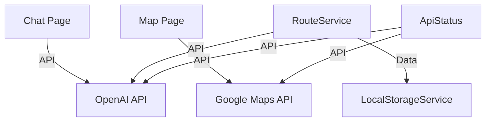

# Component Dependencies Tracking

This document outlines the approach to tracking component dependencies within the TourGuideAI project, helping to maintain a clear understanding of system architecture and impact analysis.

## Purpose

Tracking dependencies between components helps:
- Understand the full impact of changes
- Identify potential bottlenecks or single points of failure
- Plan refactoring and architectural improvements
- Manage testing scope when changes are made
- Facilitate project onboarding for new team members

## Dependency Matrix

The main dependency tracking tool is a matrix showing relationships between components:

| Component | Depends On | Dependency Type | Impact Level | Notes |
|-----------|------------|----------------|--------------|-------|
| Component Name | Dependent Component | API/Data/UI/Build | High/Medium/Low | Additional context |

### Dependency Types
- **API**: The component calls methods or functions of the dependency
- **Data**: The component consumes data structures from the dependency
- **UI**: The component renders or includes UI elements from the dependency
- **Build**: The component requires the dependency during the build process
- **Runtime**: The component dynamically loads or requires the dependency

### Impact Levels
- **Critical**: Failure in the dependency will cause complete component failure
- **High**: Failure in the dependency will severely impair component functionality
- **Medium**: Failure in the dependency will partially impair component functionality
- **Low**: Failure in the dependency will minimally impact component functionality

## Current Dependencies

### Core Dependencies

| Component | Depends On | Dependency Type | Impact Level | Notes |
|-----------|------------|----------------|--------------|-------|
| Chat Page | OpenAI API | API | Critical | Requires for route generation |
| Map Page | Google Maps API | API | Critical | Required for map display and routing |
| RouteService | OpenAI API | API | High | Needed for route planning features |
| RouteService | LocalStorageService | Data | Medium | For caching routes |
| ApiStatus | OpenAI API | API | Low | For checking API status only |
| ApiStatus | Google Maps API | API | Low | For checking API status only |

### Feature Dependencies

| Feature | Depends On | Dependency Type | Impact Level | Notes |
|---------|------------|----------------|--------------|-------|
| Route Generation | travel-planning | API | Critical | Core planning functionality |
| Map Visualization | map-visualization | UI | Critical | Core map functionality |
| User Profile | user-profile | Data | High | User data management |
| Offline Support | CacheService | Data | Medium | Required for offline access |
| Error Handling | ApiClient | API | Medium | Provides retry and fallback |

## External Dependencies

| Service | Used By | API Version | Rate Limits | Notes |
|---------|---------|-------------|------------|-------|
| OpenAI API | RouteService, ChatService | GPT-4 | 200 req/min | Rate limiting implemented |
| Google Maps API | MapService, LocationService | Maps JS v3 | 10K req/day | Caching implemented |
| Browser LocalStorage | StorageService | Web API | ~5MB per domain | Used for offline data |

## Dependency Graph Updates

The dependency matrix should be updated:
- When new components are added
- When component relationships change
- Before major releases
- After significant refactoring

## Visualization

For complex projects, a visual dependency graph can be generated from this data using tools like:
- [Mermaid](https://mermaid-js.github.io/) for embedding in Markdown
- [D3.js](https://d3js.org/) for interactive visualizations
- [GraphViz](https://graphviz.org/) for static graph generation

### Example Mermaid Diagram



## Impact Analysis Process

When making changes to a component:

1. Identify the component in the dependency matrix
2. Check all components that depend on it (reverse lookup)
3. Assess the impact level for each dependent component
4. Plan testing scope accordingly
5. Update dependent components if necessary

## Template for Recording New Dependencies

When adding a new component or dependency, use this template:

```markdown
## New Dependency

**Component Name**: [Name of the component being added or modified]
**Depends On**: [Name of the dependency]
**Dependency Type**: [API/Data/UI/Build/Runtime]
**Impact Level**: [Critical/High/Medium/Low]
**Notes**: [Additional context]

### Justification
[Explain why this dependency is necessary]

### Risk Assessment
[Describe any risks associated with this dependency]

### Mitigation Strategy
[Describe how risks will be mitigated]
```

## References

- [Software Architecture Visualization](https://c4model.com/)
- [Dependency Management Best Practices](https://martinfowler.com/articles/dependency-patterns.html)
- [Impact Analysis Techniques](https://www.bmc.com/blogs/impact-analysis/) 