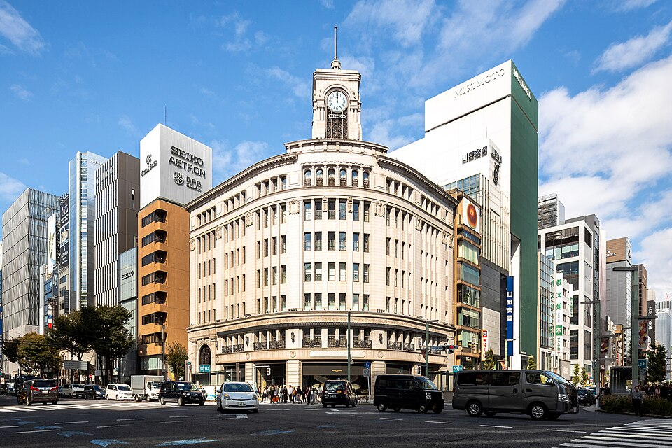

# Recognition study · Ginza 4-chōme

2026-10-07 · Owner: lead · Reference selection complete; new live scene not yet built.

## Selected place and purpose

Use **Tokyo's Ginza 4-chōme crossing, centered on the Wako clock-tower building
(SEIKO HOUSE)**. The user requested another famous street view to test whether
the depicted building feels like its real counterpart. This is the selected
reference for that test, complementing the existing Kyoto scene.

Ginza gives us a narrow, recognizable architectural target: a tower above a curved
corner, two adjoining façades and the surrounding street relationship. Asakusa's
[Nakamise](https://www.gotokyo.org/en/spot/73/index.html) is a credible alternative, but its identity depends more on a sequence
of shops, gates and street activity. Wako is the more focused test of the building
features the user identified. This selection does not establish a new playable
Tokyo district or a verified travel route.

Reference: **“Ginza Wako 20241021.jpg”**, Supanut Arunoprayote, 21 October 2024,
[Wikimedia Commons](https://commons.wikimedia.org/wiki/File:Ginza_Wako_20241021.jpg),
[CC BY 4.0](https://creativecommons.org/licenses/by/4.0/).
This is Wikimedia's uncropped 960px thumbnail, with no additional alterations.
The lead and art reviewer inspected the original photograph; the retained image
is a research reference, not a render from our app. [File identity and limits](../evidence/recognition-selection-20261007/reference.json).

## Reference-supported anchors

| Feature visible in the photograph | What the live model must make recognizable | What remains unverified |
|---|---|---|
| Narrow clock tower above the corner | Round clock, dark grille, stepped rectangular crown and flagpole; tower position and proportion relative to the body | Exact dimensions and unseen tower faces; do not substitute a dome |
| Convex rounded corner joining two wings | Curved façade, continuous cornice and lower bands; believable relation to both streets | Exact radius and dimensions; a rectangular block is not an adequate replacement |
| Window hierarchy | Round-headed central upper openings, different wing openings, narrow rectangular windows below and substantial pale piers | Full bay counts and depth need an annotated source pass before modelling |
| Horizontal architectural divisions | Projecting cornices, decorated lower band, patterned railings and circular reliefs interrupt the vertical rhythm | Carving dimensions and material specification |
| Recessed ground interface | Dark glazing and solid piers have depth; the left-side arched portal remains distinct | Vehicles and people obscure details; tenant/door assignments, interiors and access are not established |

The photograph's warm pale appearance is affected by exposure and daylight. It is
not a calibrated material colour. Temporary signs, displays, people and traffic
document a 2024 view, not verified current conditions. Lighting should reveal
the architectural anchors without baking the photograph's shadows into materials.

## Source lock and remaining gaps

- [Official SEIKO HOUSE](https://www.seiko.co.jp/en/seiko_house_ginza/) identifies
  the building and records completion of the clock-tower building in 1932.
  Its floor guide does not establish surveyed overall or tower dimensions.
- [Wako OSM way 103509469](https://www.openstreetmap.org/way/103509469), version 15,
  modified 2026-01-28, reports seven levels and a height tag of 28. Its closed
  footprint has twelve distinct vertices, including the sampled curved corner.
  These are source-reported values, not independent measurement; whether the
  height includes the tower is unresolved. Do not silently use 28m as tower height.
- The geometry was read from the [official OSM map API](https://api.openstreetmap.org/api/0.6/map?bbox=139.7640,35.6710,139.7658,35.6722).
  Before modelling, preserve the exact selected geometry and source version in
  the new scene's evidence. Attribute © OpenStreetMap contributors under
  [ODbL](https://www.openstreetmap.org/copyright); road centrelines do not measure kerbs or widths.
- Mitsukoshi is orientation context only. The available
  [2018 photograph](https://commons.wikimedia.org/wiki/File:Ginza_Mitsukoshi_2018.jpg)
  predates its [2020 Ginza Chandelier façade treatment](https://www.mistore.jp/store/ginza/event_calendar/ginzachandelier.html).
  Do not use it to claim current neighbouring-façade accuracy.
- Obtain an independent second-angle reference and an unobstructed lower-frontage
  reference before locking unseen geometry or testing recognition transfer.
  The selected photograph alone cannot establish those views or entrances.

No Google Street View pixels or extracted geometry are used. External source
pages support identity and research; permission to copy their photographs must
be checked separately. The retained Wako photograph has the explicit licence above.

## Proposed live-browser slice

Reuse the A rendering approach and Blender asset pipeline. Bound the new study to
the Wako corner, the two adjoining frontage segments and enough opposite pavement
to communicate human scale. Use neutral daylight first to expose form; night
lighting follows after those features read correctly. Kyoto retains both modes.

Provide three live presets: **whole corner and tower**, **oblique façade**, and
**pedestrian-scale ground interface**, with limited orbit, zoom, reset and a short
camera approach. The first preset follows the inspected photograph; final camera
values and the other reference matches remain work for the source/art sprint.
Do not claim the three views are already implemented or all independently sourced.

Engineering's smallest boundary is a separate live-study entry, for example
`street.html?scene=ginza-wako`, with allowlisted local model, camera, source and
scene-specific lighting metadata. This is a proposed route, not a live link.
Kyoto's simulation, road assumptions, saved coordinates and recap are specific to
`kyoto-shijo`; changing a model filename is insufficient. The study must import
no Kyoto journey orchestration and make no journey or note writes. An approach
is camera motion here, not new pedestrian navigation. No extra B stills are needed
to establish this live recognition test; the delivered A/B comparison remains.

## Review that can fail

1. **Architectural agreement:** compare actual browser frames and camera motion
   with the source. Wrong tower placement, wrong corner form, missing window
   hierarchy or unreadable anchors due to glare/shade require revision.
2. **Recognition beyond a logo:** first remove the location title. Have someone
   familiar with the place identify it and point to the visible supporting cues.
   Separately inspect the façade body with clock/name cues concealed; a recognisable
   clock on generic architecture is insufficient. This is a proposed review setup,
   not an image transformation already performed on the source photograph.
3. **Transfer:** after an unfamiliar participant explores the scene, use an unseen
   real-reference angle to test what they recognise. Do not teach the answer with
   that test photo beforehand. Until a second reference and participant are
   available, this gate remains pending.
4. **State and usability:** exercise the new view, return to a seeded Kyoto walk,
   and verify unchanged position, choices and notes. Check EN/ZH camera controls,
   actor/scale cues where present, ordinary-device interaction and missing-asset
   recovery. Automated state checks do not prove visual recognition.

Record prior familiarity, reference dates, build, device, language, explanations
and assistance. Keep recognition, attractiveness, factual accuracy, fluency and
product usefulness separate. The reported “60% positive” realism feedback has
no known denominator or method and supplies no automatic pass threshold.

The [positioning proposal](positioning.md) keeps this architectural study parallel
to the proposed discovery, personal-moment and recipient-experience prototype.
Recognizable architecture supports that experiment; it cannot establish its
enjoyment, social value or real-world effects. Reference selection is complete;
implementations and human results remain future work.
