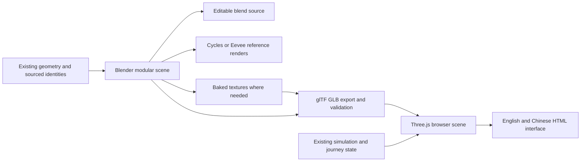

# Next iteration · a vivid, three-dimensional Kyoto

Owner: lead. Research and bounded technical proof completed 2026-10-05;
playable integration and product acceptance remain ahead. User direction: make the experience more
vivid and three-dimensional, investigate Blender for asset generation/rendering,
and make this the next iteration's main target.

## Decision and intended experience

**Recommend Blender-authored assets exported as GLB, rendered in a small Three.js
scene, with the current HTML interface and gameplay state retained.** Use a guided
three-quarter camera with restrained rotation and zoom and a reset view.
The user approved guided 3D for the first launched version on 2026-10-05:
"Guided 3D view is okay for the first launched version." This closes the camera
preference question. Exact framing, limits and player-follow behavior still need
validation in the first integrated encounter.

The iteration should make the existing Shijo block feel like a place with volume:
recessed windows and doorways, visible building sides, grounded characters,
consistent contact shadows, readable materials, modest parallax and restrained
ambient motion. A new renderer by itself does not satisfy this goal. EN/ZH
objectives and cards remain readable and stable while the world gains depth.

The current first playable remains the comparison and recovery baseline. Its
44 browser checks are behavior contracts to rerun, not inherited passes for 3D.
The old melonJS decision was for the approved 2.5D scope; the new user direction
justifies an isolated renderer evaluation. No production renderer has been replaced
by this research. The final implementation decision follows the browser proof and
one integrated encounter, not a Blender beauty render alone.

## Technology options

| Route | What it gives us | Main cost or limitation | Decision |
|---|---|---|---|
| Blender renders → layered sprites in melonJS | Strong baked lighting and modeled detail; retains existing runtime; low browser rendering demand | Camera angles are baked; rotation requires more views/assets; dynamic shadows and actor occlusion need authored layers | Useful fixed-camera option and fallback; does not provide the same spatial interaction as real 3D |
| Blender → GLB → Three.js/WebGL2 | Actual geometry, perspective/parallax, camera control, PBR materials and dynamic interaction; can reuse the existing DOM UI and pure simulation | We must implement the renderer adapter, picking, camera constraints, occlusion and lifecycle handling | Recommended for the focused next iteration, subject to measured proof |
| Blender → GLB → Babylon.js | Integrated scene/asset/camera tools, engine facilities and WebGL/WebGPU paths | Larger engine integration surface for a small existing custom game; importing physics or rebuilding gameplay is not automatically necessary | Credible alternative if the prototype reveals a concrete Three.js limitation; not benchmarked against Three.js here |
| Entire block as a rendered video or flat image | Consistent Blender appearance, simple display | No equivalent player-relative depth, dynamic occlusion or arbitrary interactive camera | Reference/marketing output only; insufficient as the main interactive experience |

WebGPU is not an iteration requirement. Start with the broader, established WebGL2
path. Three.js's current WebGLRenderer explicitly requires WebGL2; unsupported
hardware needs an understandable EN/ZH fallback that preserves progress and notes.
Do not describe a WebGL1 fallback that this renderer no longer provides.
The Three.js recommendation is about a focused renderer adapter for our existing
game. It is not evidence that Babylon.js is intrinsically slower or necessarily
ships a larger bundle; no matched Babylon benchmark was performed.

## What Blender does, and what the browser does

Blender is the authoring, baking and offline rendering tool. It does not execute
inside the game page. The browser renders the exported meshes/materials each frame.
Cycles can provide reference images and baked AO/normal/material textures;
Eevee can support fast authoring previews. Neither renderer's full scene appearance
is automatically reproduced by glTF export or a different browser renderer.

Use Principled PBR materials that the exporter supports. Arbitrary procedural
node graphs require baking or replacement. Set texture color spaces, normal-map
convention, exposure and tone mapping deliberately. Baking all sunlight into base
color and then adding a second full sun produces incorrect double lighting.
Transmission, alpha and many overlapping glass layers are optional effects to
justify by measured benefit, not prerequisites for convincing building depth.

## Pipeline contract

- **Source of truth:** consume existing `WORLD`, crossing and interaction IDs.
  Never move real coordinates to make the camera composition easier. Building
  heights, backfaces, roof shapes, facade subdivisions and vegetation remain
  authored unless separately evidenced. A modeled door is not a verified entrance.
- **Coordinates:** meter units; Blender X=east, Y=north, Z=height. With the glTF
  Y-up export, the expected browser mapping is `(x, height, -north)`. Prove this
  with known markers and bounds; do not rely on memory of axis conventions.
- **Editable production assets:** retain `.blend`, generator settings, material
  palette, named modules, asset provenance and tool version. Use consistent pivots
  and apply the intended transforms/modifiers before export.
- **Game bindings:** stable IDs/custom properties can travel through glTF `extras`.
  Keep interaction anchors and collision proxies simple, distinct from decorative
  meshes and costly visual raycasts. Preserve source-read, visit and choice state.
- **Runtime optimization:** reuse materials and meshes; instance repeated objects
  or batch compatible static geometry. Measure actual exported triangles and draw
  calls; Blender object counts and source polygon counts are not equivalent costs.
- **Delivery:** begin with ordinary GLB and embedded/local assets. Add Meshopt/Draco
  and KTX2 only when measurements justify their decoder/transcoder complexity.
  All decoder JS/WASM, fonts, environment textures and GLBs must be included in the
  offline package; default sample CDN URLs do not meet the offline contract.
- **Versioning:** the executor provides Blender **4.3.2** for the proof. For asset
  production, recommend a pinned **4.5 LTS** patch plus an export regression check;
  the official page states support through July 2027. Do not silently upgrade the
  production toolchain or claim the installed proof tested a different version.
- **Rights:** original assets avoid third-party art procurement. Blender's license
  permits use of created artwork and `.blend` files independently of the program's
  GPL. Distributed Python tools using `bpy` have separate licensing considerations;
  keep their notices distinct from artwork and the browser application.

## Bounded technical proof

A small reproducible experiment is available under
[`iteration/experiments/blender-depth/`](../experiments/blender-depth/README.md).
It uses the existing block geometry and original authored volumes, not a new city
pack or production game migration. The tested Blender 4.3.2 generator retains
888 modular objects in editable source and exports 28 PBR mesh primitives with
109,156 triangles. The final GLB is **5,293,648 bytes** and has no external image
or decoder dependencies. Two fresh runs of the fixed generator produced the same
GLB SHA-256: `52fb13711fd2fdf3e63f244c5a42e871e15dc903a845120bcbc7ce1c4116f47d`.
The 960×640 Cycles CPU reference used 32 samples; one observed render took 9.48 s.

Comparing the actual browser and Blender images found two real fidelity problems:
material batching initially discarded per-face smoothing, and runtime shadows
striped flat surfaces. The generator now preserves smoothing; the browser uses a
tighter shadow frustum and corrected bias. The installed Blender lacks the optional
denoiser, so the reproducible render explicitly disables it. These corrections
are evidence for testing the full export/render chain, not just the `.blend` view.

The proof remains a static asset/camera experiment: no character animation,
production texture baking/compression, gameplay migration or hardware performance
acceptance is demonstrated. The wide overview makes the traveler and Japanese
signs small, and the initial view sees the south building's roof/back. Resolve the
playable framing and south-side occlusion before producing the final art kit.
Its EN/ZH research interface uses system fonts; Japanese facade lettering is mesh
geometry. This is not a new cross-platform offline-font validation. Production
integration must keep the first playable's bundled-font and localization contract.
Global material batching also drops individual static building/door properties;
retain the `world.json` and `metrics.json` sidecars, and introduce semantic/spatial
chunks before selective occlusion, animation or picking. Browser evidence is
recorded separately from the offline reference image.

### Final browser evidence

Independent QA passed **24/24 technical checks** on the frozen HTML below, using
Chromium 151.0.7922.173 and Three.js 0.186.1. Actual pointer drag/wheel, bounded
camera presets/reset, EN/ZH controls and accessibility labels, resize, reduced
motion, context loss and WebGL creation failure were exercised. All three browser
scenarios made zero secondary requests. The normal run had no console or uncaught
errors; forced WebGL failure produced only the expected renderer-creation error.
A reset defect discovered after real dragging was fixed by flushing OrbitControls
inertia through its public API before restoring the canonical camera pose.

| Measurement | Observed result and interpretation |
|---|---|
| Frozen standalone HTML | 8,793,038 bytes; computed gzip 2,175,358 bytes, not measured network transfer |
| HTML SHA-256 | `3bab295e28b0d102e196424c63ba1362f176265045dd4b76b7a83b4b6053399e` |
| Scene cost | 109,156 triangles; 28 meshes/materials; zero source image textures or external decoders |
| First frame including shadow pass | 56 draw calls and 218,312 submitted triangles |
| Static steady frame | 28 draw calls and 109,156 triangles; cached shadows must be invalidated for production animation |
| GLB decode, parse and setup | 641.1 ms in this executor; excludes HTML transfer and JavaScript parsing |
| First render submission | 733 ms from GLB decoding; not guaranteed display-paint time or cold page loading |
| Software-rendered cadence | About 800 ms median sampled frame interval on ANGLE/Vulkan SwiftShader; visibly slow, **not a fluency pass** |

This validates compatibility, geometry transfer and camera behavior. It does not
establish desktop GPU performance, production gameplay, save migration or human
art acceptance. The storage check only verified that this isolated proof leaves
an existing sentinel untouched. The WebGL recovery is an explicitly labeled fixed
reference image; a layered-sprite gameplay fallback has not been built. Native
`file://` launch remains unverified because managed Chromium blocks that scheme.

Preserved evidence:
[QA report](../../.dsh/artifacts/evidence/blender-depth/qa-result.json),
[build inventory](../../.dsh/artifacts/evidence/blender-depth/build-report.json),
[repeat-export record](../../.dsh/artifacts/evidence/blender-depth/reproducibility.json),
[English browser view](../../.dsh/artifacts/evidence/blender-depth/qa-en-initial.png),
[Chinese rotated view](../../.dsh/artifacts/evidence/blender-depth/qa-zh-pointer-zoom.png),
and [Blender reference](../../.dsh/artifacts/evidence/blender-depth/render.png).
The captured QA runner is retained beside the results for audit; its paths and
Playwright/Chromium installation describe this executor, not a portable test setup.
The repository integrity suite also passed 17/17 with no skips. The first-playable
source hashes and standalone HTML remain unchanged from their delivery manifest.

**V3D-0 is complete.** Proceed next to one integrated graybox encounter and camera
contract before adopting the renderer for production and polishing the wider art kit.

## Iteration scope and sprints

This visual iteration takes priority over the previously next SP4 full-guide work
and SP5 destination expansion. Those remain in the backlog. No dates or staffing
capacity were supplied, so these are outcome-based sprints, not invented deadlines.

| Sprint | Owner and collaborators | Concrete deliverable | Exit criterion |
|---|---|---|---|
| V3D-0 · Research and feasibility | Engineering + art; independent QA; lead decides | Comparison, reproducible `.blend` → GLB → browser proof, camera proposal and measured costs | Same asset hash loads in browser; axes/materials/depth assessed; limits and architecture decision written |
| V3D-1 · Camera contract and production art kit | Engineering + art + world/content; design review | First prove one graybox encounter with camera/input/picking/occlusion; then produce the street modules, player animation, palette and lighting | Adopt the renderer after the encounter works; freeze framing before broad art production; user assesses actual-size direction; source boundaries and reproducibility retained |
| V3D-2 · Playable integration | Engineering + design; art supports | Existing three encounters in the 3D scene, guided camera, grounded walk, picking/occlusion, bilingual cards and saved journey | Full movement → approach → choice → close → resume works in EN/ZH, with unchanged route/source meanings; old saves retained |
| V3D-3 · Polish and acceptance | QA + art + design; user reviews | Restrained ambient animation, reliable loading/fallback, optimized offline build, paired before/after and interactive review | Real-browser quality and fluency pass separately, regression and hardware evidence recorded, user review completed |

Animation scope is intentionally small: a convincing player idle/walk/turn,
subtle foliage or light activity, and immediate but restrained interaction feedback.
Ambient people/traffic, if added, are decorative and must neither obstruct reading
nor imply sourced traffic rules, schedules or business activity. Full city roaming,
interiors, new destinations, day/night simulation, multiplayer and a redesign of
the whole interface are outside this iteration.

Team review changed the sequence: engineering and QA require the camera-relative
controls, picking and occlusion contract to work on a graybox before the production
art kit is polished. World/content also distinguishes the mapped facade drift from
the current flat-front presentation approximation; floor counts do not establish
physical heights. These are production inputs to resolve, not details a renderer
upgrade can make factual by appearance alone.

## Acceptance and measurement

**Art quality:** compare the first playable and the new scene at the same route,
viewport and approximate player scale. Building thickness, recesses, shadows and
foreground/midground/background separation must remain visible while moving and
when the camera changes. The traveler and actionable target remain findable;
materials, lighting and motion feel coherent. A Blender-only screenshot cannot pass.

**Interaction:** retain keyboard/pointer walking, accurate raycast-to-world mapping,
collision/proximity agreement, stable prompts, modal pause, close/resume, language
switching, saves and choice-derived notes. Limit the camera so users cannot get
lost or trapped inside walls; provide a reset view. Disable optional camera inertia,
ambient motion and pulses for reduced motion. Keep HTML objectives/cards legible.

Current collision behavior clamps facades/world bounds; it does not establish
solid collision for every decorative prop. Add explicit simple collision proxies
where new volumes should obstruct walking. Current WASD directions are cardinal;
for the rotating 3D camera, propose camera-relative ground-plane input while keeping
saved positions in unchanged world coordinates. Specify and test this mapping
before integration, including moving while rotating and camera reset. Do not reuse
old screen-direction assertions as if the camera had not changed.
For deterministic replay, record the resulting per-tick world-space movement
vector, or the keys together with quantized camera orientation. Key names alone
cannot reproduce movement when the player is also rotating the camera.

**Engineering checks:** validate GLB structure and source/build hashes; missing
materials/assets; off-screen culling and repeated-scene resource disposal; resize;
WebGL2 unavailable/context loss; loading and retry without save loss. Exercise the
packaged bytes with secondary network denied. Direct `file://` launch remains a
separate browser test; the previous environment policy limitation still applies.

**Provisional budgets to calibrate, not guarantees:** nominate a representative
integrated-GPU desktop and test 1280×720 and 1440×900 at DPR 1. Aim for 60 fps;
investigate p95 frame intervals above 33.3 ms and any reproducible input hitch.
Begin the asset review around 200k visible triangles, 100 draw calls, 128 MiB of
decoded textures and 15 MiB of initial scene assets. These are review thresholds,
not permission to consume the entire budget; prefer the smallest scene that
achieves the art target. Record compressed transfer size, decoded memory, first
visible frame and interaction-ready time separately. Select actual hardware and
network conditions before making performance acceptance claims. Cloud software
rendering provides a compatibility probe, not a laptop GPU benchmark.
Count draw calls across the complete frame, including shadow or extra passes.
Three's `renderer.info.memory` counts objects; it does not report GPU byte usage.
Estimate decoded texture bytes from actual dimensions, formats and mip chains,
and account for shadow maps and render targets separately.

The former first-playable human quality approval is still unrecorded. The new
request is actionable feedback and a priority change, not retroactive approval.
Fresh-user discoverability and the real Kyoto field walk remain separate tests.

## Primary references read

Read 2026-10-05; use versioned Blender documentation for the tested 4.3 toolchain.

1. [Blender 4.3 glTF exporter](https://docs.blender.org/manual/en/4.3/addons/import_export/scene_gltf2.html): supported PBR material patterns, triangulation, modifiers, extras, animations and Y-up export.
2. [Blender 4.3 Cycles baking](https://docs.blender.org/manual/en/4.3/render/cycles/baking.html): material/normal/AO/light-map baking and UV/image prerequisites.
3. [Blender 4.3 command-line rendering](https://docs.blender.org/manual/en/4.3/advanced/command_line/render.html): headless, repeatable authoring/render automation.
4. [Blender 4.3 Eevee introduction](https://docs.blender.org/manual/en/4.3/render/eevee/introduction.html): rasterized preview/render role and distinction from Cycles.
5. [Blender 4.5 LTS](https://www.blender.org/releases/4-5/): supported production version horizon.
6. [Blender licensing](https://www.blender.org/about/license/): program, Python tools and created artwork are distinct cases.
7. [Three.js WebGLRenderer](https://threejs.org/docs/pages/WebGLRenderer.html): WebGL2 requirement and runtime controls.
8. [Three.js GLTFLoader](https://threejs.org/docs/pages/GLTFLoader.html): GLB loading, compression extensions and explicit decoder dependencies.
9. [Three.js OrbitControls](https://threejs.org/docs/pages/OrbitControls.html): constrained orbit/zoom and optional damping.
10. [Khronos glTF](https://www.khronos.org/gltf/): interoperable runtime asset format, rather than distributing `.blend` as the browser asset.
11. [Babylon camera introduction](https://doc.babylonjs.com/features/featuresDeepDive/cameras/camera_introduction/) and [glTF importer](https://doc.babylonjs.com/features/featuresDeepDive/importers/glTF/): ArcRotate camera and GLB integration; explicit offline configuration for decoder resources otherwise loaded from the CDN.
